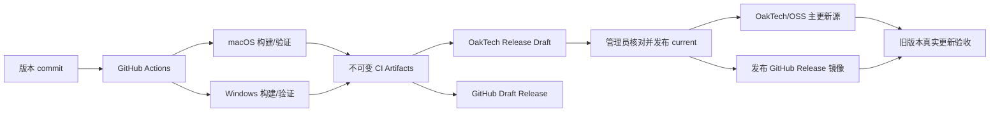

# 桌面 App CI/CD：双平台构建、商店发布与在线更新

本文定义 GitFinder 等 Electron 桌面应用的标准发布路径。正式制品必须由 GitHub Actions 的干净 Runner 生成；开发机本地构建只用于预检，不得直接成为公开更新源。

## 1. 发布模型

角色边界：

- GitHub Actions：构建、测试、签名、公证、哈希和上传草稿。
- OakTech 后台：产品、版本说明、制品清单、历史版本和 current 指针的事实来源。
- GitHub Releases：相同版本制品的公开镜像/备用下载源，不是 Git 仓库历史的一部分。
- OSS/CDN：面向国内用户的推荐下载承载，可由 OakTech 发布服务同步。
- 管理员：核对版本、commit、说明、签名和制品后执行最终发布。

## 2. 版本与不可变性

- 使用 SemVer；预发布示例：`2.0.0-alpha.92`。
- `package.json`、lockfile、应用 About/health 信息、manifest 和制品文件名必须一致。
- 同一版本一旦公开，不覆盖二进制。修复必须递增版本。
- current 是可回滚指针；历史版本记录和制品是不可变对象。
- 安装包不提交到 Git 历史。GitHub 官方仓库只保存源码、工作流和小型元数据；二进制使用 Actions Artifacts、GitHub Releases、OakTech 持久卷或 OSS。

## 3. 触发方式

### Source CI

GitFinder 仓库的 `.github/workflows/ci.yml` 在 Pull Request、`main` push 和人工触发时运行，使用 Linux、macOS、Windows 三个平台执行锁定依赖安装与 `npm run check`。该工作流只有源码读取权限，不加载商店、签名、公证或对象存储密钥。

### Build workflow

GitFinder 仓库的 `.github/workflows/release.yml` 使用 `workflow_dispatch`，要求输入：

- `expected_version`
- 中英文标题
- 中英文发布说明
- 是否上传 OakTech 草稿
- 是否创建 GitHub Draft Release

流水线必须从已经提交并推送的干净 commit 启动。`expected_version` 与 `package.json` 不一致时立即失败。

### Publish workflow

GitFinder 仓库的 `.github/workflows/publish-release.yml` 使用受保护的 `oaktech-publish` Environment：

1. 管理员先在 OakTech 后台核对并切换 current。
2. 发布工作流读取公开 updater manifest，确认版本已等于预期值。
3. 将同版本 GitHub Draft Release 切为公开 prerelease/stable release。
4. 对主源与镜像执行下载、大小和 checksum 验证。

最终发布不能由普通构建 job 自动完成，避免“构建成功”被误当成“允许公开”。

## 4. macOS 构建门禁

Runner：Apple Silicon 对应的受支持 macOS Runner；输出至少包括：

- macOS ZIP（electron-updater 必需）
- DMG（用户手动安装）
- `latest-mac.yml`
- 构建验证报告和 checksum

正式渠道还必须：

- Developer ID Application 签名。
- Apple notarization 成功并 stapling。
- `codesign --verify --deep --strict` 与 Gatekeeper 检查通过。
- manifest 的 URL、size、sha512 与最终上传文件一致。

Alpha 若暂时使用 ad-hoc 签名，必须在后台和发布说明中明确标记为测试制品，不能冒充正式可自动更新版本。

## 5. Windows 构建门禁

Runner：`windows-latest` x64；输出至少包括：

- NSIS Setup EXE（自动更新正式目标）
- EXE blockmap
- Portable ZIP（历史/手动下载，不进入 updater manifest）
- `latest.yml`
- SHA256 列表、构建元数据、安装/卸载验证报告

正式渠道还必须：

- 使用可信代码签名证书签名 EXE。
- 验证签名和时间戳。
- 在全新 Windows 环境完成安装、首次启动、升级、保留数据和卸载测试。
- 未签名 Alpha 必须显示 SmartScreen 风险说明，且不能标记为 signed release candidate。

## 6. 统一构建阶段

两个平台都必须执行：

1. Checkout 精确 commit。
2. 固定 Node 主版本，`npm ci` 安装 lockfile 依赖。
3. 校验版本输入。
4. 运行语法、单元、模型、文件操作和平台专项测试。
5. 构建目标制品。
6. 从最终文件重新计算 checksum，不信任客户端传入值。
7. 上传短期 Actions Artifacts，供后续 job 汇总。

任一平台失败，OakTech/GitHub 草稿 job 都不得执行。

## 7. OakTech 草稿上传

汇总 job 生成不可变 `store-release.json`，包含：

- 产品 slug、版本、channel、源 commit。
- 中英文标题和说明。
- 每个制品的平台、架构、类型、文件名、大小、SHA-512。

机器凭据只允许：

- 创建或幂等恢复同版本草稿。
- 分片上传制品。
- 查询上传进度和重新上传缺失分片。

机器凭据不允许切换 current 或删除历史版本。服务端在完成上传与最终发布前都重新计算文件哈希。

GitHub Environment `oaktech-release`：

| 类型 | 名称 | 用途 |
| --- | --- | --- |
| Variable | `OAKTECH_RELEASE_BASE_URL` | OakTech API 根 URL |
| Secret | `OAKTECH_RELEASE_WRITE_TOKEN` | 过渡机器发布凭据；后续替换为 OAuth Client Credentials |

## 8. GitHub Releases 镜像

- Build workflow 创建 `v<version>` 的 Draft Release，上传与 OakTech 完全相同的安装包、manifest 和 checksum。
- Draft 对公众不可见，不会抢先成为下载源。
- OakTech current 发布成功后，Publish workflow 才把 GitHub Draft 改为公开。
- 应用默认更新地址仍是 OakTech/OSS；GitHub 作为网页备用下载或灾备源。
- 私有 GitHub Release 不适合作为普通终端用户更新源，因为客户端将需要访问凭据。

GitHub Release 中推荐保留：

- macOS ZIP/DMG 与 `latest-mac.yml`
- Windows NSIS/blockmap/portable ZIP 与 `latest.yml`
- SHA256/SHA512 checksums
- 双语 release notes 和源 commit

## 9. 发布事务与同步顺序

1. 确认 OakTech 草稿与 GitHub Draft 使用相同版本和源 commit。
2. 核对两个平台必需制品均存在，size/hash 相同。
3. OakTech 后台生成版本化 manifest。
4. 原子切换 OakTech `(product, channel)` 的唯一 current。
5. 从公网重新下载 manifest，确认 URL、version、sha512。
6. 发布 GitHub Draft Release。
7. 从 GitHub 与 OakTech 各抽检至少一个大制品。
8. 在真实旧安装版执行更新检查、用户确认、下载、安装和数据保留验收。

若 GitHub 镜像发布失败，OakTech 主源可继续服务，但后台必须显示“镜像未同步”并允许幂等重试；不得覆盖已公开的同版本文件。

## 10. 在线更新客户端要求

- 启动自动检查由用户开关控制，默认只静默检查，不自动下载/安装。
- 手动“检查更新”始终可用，不受自动检查开关影响。
- 发现新版本后必须由用户确认下载/安装。
- 无更新时显示“当前版本”和“线上版本”，避免把远端版本更旧误报成源故障。
- 错误提示保留可诊断错误码，并提供打开历史版本页面的入口。
- macOS 使用 `latest-mac.yml + ZIP`；Windows 使用 `latest.yml + NSIS + blockmap`。
- 客户端验证代码签名；服务端和 manifest 哈希用于传输完整性，不能替代签名信任。

## 11. 密钥与权限

可能使用的 GitHub Secrets：

- Apple Developer 证书、证书密码、notarization 凭据。
- Windows 代码签名证书/服务凭据。
- `OAKTECH_RELEASE_WRITE_TOKEN` 或后续机器 OIDC 凭据。
- OSS/R2 上传凭据（仅写指定 bucket/prefix）。

规则：

- Secrets 仅在受保护 Environment 的必要 job 可见。
- Fork PR 永远不能获得发布、签名或对象存储凭据。
- 不在日志打印 Token、证书、Cookie 或完整环境。
- GitHub `GITHUB_TOKEN` 只给 GitHub Draft/Publish job `contents: write`，其他 job 保持 `contents: read`。

## 12. 失败恢复

| 失败位置 | 恢复方式 |
| --- | --- |
| 单平台构建失败 | 修复后从新 commit 重跑；不手工拼接不同 commit 的平台制品 |
| 上传中断 | 按 releaseId/offset 幂等续传，服务端重新验证最终 hash |
| OakTech 草稿错误 | 草稿状态修正或删除；未发布时不影响 current |
| manifest 错误 | 禁止发布，重新生成并复核，不手工修改线上 YAML |
| GitHub Draft 失败 | 保留 OakTech 草稿，重跑镜像 job |
| 发布后客户端失败 | 立即将 current 回滚到上一已验证版本；保留失败版本供取证 |
| 某地区下载慢 | 切换/修复 OSS 镜像，不改变版本号与文件内容 |

## 13. 回滚

- 回滚只改变 channel 的 current 指针，不删除新版本。
- 回滚 manifest 必须重新指向上一版本的原始不可变文件。
- GitHub 上将问题版本标记为 prerelease/说明问题；是否撤下需保留审计记录。
- 已安装新版本用户不能依赖“降低 latest 版本”自动降级，应发布更高修复版本或提供明确人工回退包。

## 14. 完成标准

- macOS 与 Windows job 均来自同一 commit 且全部通过。
- OakTech 草稿和 GitHub Draft 的版本、文件、大小与 checksum 一致。
- 管理员明确执行最终发布。
- OakTech 公网 manifest/current 正确，GET/HEAD/Range 正常。
- GitHub Release 镜像可下载。
- 至少一个真实旧版完成端到端更新；取消更新和关闭自动检查也被验证。
- 发布记录包含版本、commit、运行链接、制品、签名状态、生产验证和回滚点。

只有完成上述闭环，才可以称为“App 已发布”；本地打包、Actions 绿色或制品上传成功都只是中间状态。
